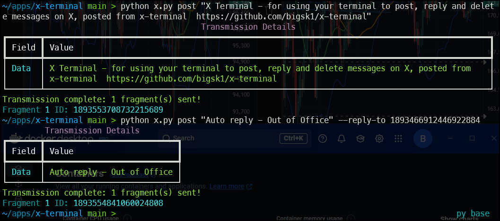
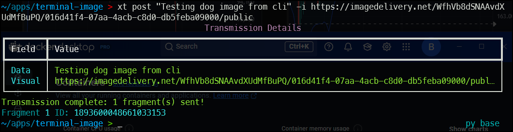
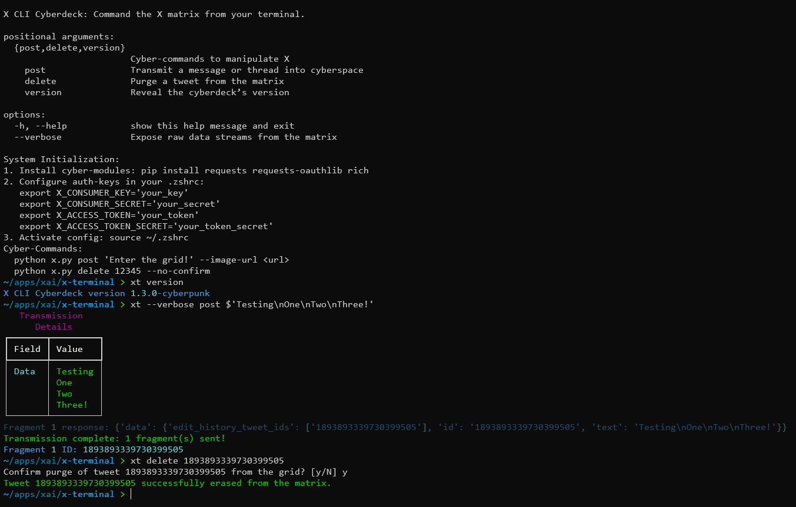

# X Terminal 


A tool to manage X posts - tweet, reply, delete, image uploads (e.g., Cloudflare Images). Python 3.10+, Windows and Linux




Get X Dev account is free
https://developer.x.com/

## Setup Instructions

### Install Dependencies
```sh
pip install requests requests-oauthlib rich
```

### Set Environment Variables (e.g., in `.zshrc` or `.bashrc`)
```sh
export X_CONSUMER_KEY="your_key"
export X_CONSUMER_SECRET="your_secret"
export X_ACCESS_TOKEN="your_token"
export X_ACCESS_TOKEN_SECRET="your_token_secret"
```

### Apply Changes
```sh
source ~/.zshrc
```


## General Usage
```sh
python x.py [global_options] <command> [command_options]
```

### Global Options
These can be used with any command:

- `--verbose`  
  - **Description:** Expose raw data streams from the X matrix (e.g., API responses) for debugging.  
  - **Example:**  
    ```sh
    python x.py post "Test" --verbose
    ```
  - **Output:** Shows detailed JSON responses from API calls.

- `--help` or `-h`  
  - **Description:** Display the full help menu with setup instructions and examples.  
  - **Example:**  
    ```sh
    python x.py --help
    ```
  - **Output:** Lists all commands, options, and setup steps.

---

## Commands and Their Options

### `post`
Transmit a message or thread into X cyberspace, with optional image or reply.

#### Usage
```sh
python x.py post "message" [options]
```

#### Options
- **message (required)**  
  - **Description:** The data packet to transmit (supports emojis).  
  - **Example:** `"Testing the grid! 😊"`

- `-i` or `--image-url`  
  - **Description:** URL of a visual payload (e.g., Cloudflare Image URL).  
  - **Example:**  
    ```sh
    --image-url https://imagedelivery.net/.../public
    ```
  - **Note:** Works with URLs lacking extensions if they serve images (checked via content-type).

- `--reply-to`  
  - **Description:** Target tweet ID to reply to in the grid.  
  - **Example:**  
    ```sh
    --reply-to 1893520325645861269
    ```

- `--dry-run`  
  - **Description:** Simulate transmission without sending to X (preview only).  
  - **Example:**  
    ```sh
    --dry-run
    ```
  - **Output:** Shows tweet fragments and image URL without posting.

#### Examples
```sh
# Simple post
python x.py post "Hello cyberspace!"

# With image only
python x.py post "🖼️" -i https://imagedelivery.net/WfhVb8dSNAAvdXUdMfBuPQ/695bc126-614d-4571-908d-5a5173127100/public

# Thread preview - dry run doesn't send
python x.py post "This is a long message that will split into multiple parts..." --dry-run

# Reply to post
python x.py post "Hey World" --reply-to 1893572351994019980

# Reply to post with message and image
python x.py post "Hey World" --reply-to 1893572351994019980 -i https://imagedelivery.net/WfhVb8dSNAAvdXUdMfBuPQ/695bc126-614d-4571-908d-5a5173127100/public

# Delete post
python x.py delete 1893529363959947744
```



---

### `delete`
Purge a tweet from the X matrix by its ID.

#### Usage
```sh
python x.py delete <tweet_id> [options]
```

#### Options
- **tweet_id (required)**  
  - **Description:** The ID of the tweet to erase.  
  - **Example:** `1893529363959947744`

- `--no-confirm`  
  - **Description:** Bypass the confirmation prompt for deletion.  
  - **Example:**  
    ```sh
    --no-confirm
    ```
  - **Default:** Prompts `"Confirm purge of tweet <id>? [y/N]"`

#### Examples
```sh
# With prompt
python x.py delete 1893529363959947744

# No prompt
python x.py delete 1893529363959947744 --no-confirm
```

---

### `version`
Reveal the cyberdeck’s version.

#### Usage
```sh
python x.py version
```

#### Options
None

#### Example
```sh
python x.py version
```
**Output:** `X CLI Cyberdeck version 1.3.0-cyberpunk`

---


## Notes
- **Image URLs:** Compatible with Cloudflare Image URLs (e.g., `https://imagedelivery.net/.../public`) as long as they return an `image/*` content-type.
- **Threads:** Messages longer than 280 characters are automatically split into a thread, with images attached to the first tweet.
- **Cyberpunk Theme:** Terminal output uses neon colors (cyan, magenta, green) and futuristic terms like "matrix" and "transmission."
- **Windows:** For best emoji support (e.g., 😊), use Windows Terminal; a warning appears otherwise.

---

## Example Usage Scenarios

### Post with Cloudflare Image
```sh
python x.py post "Cyberpunk terminal test" --image-url https://imagedelivery.net/WfhVb8dSNAAvdXUdMfBuPQ/8a36640e-0d4d-4753-f269-77d3b5946200/public
```

### Delete a Tweet
```sh
python x.py delete 1893529363959947744
```

### Check Version
```sh
python x.py version
```




 [](https://x.com/bigsk1_com)
